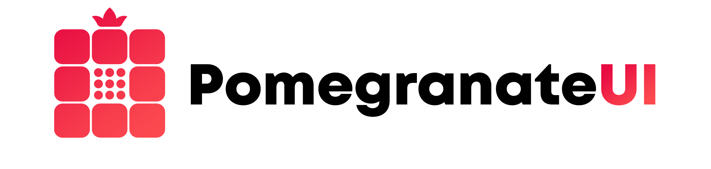

# PomegranateUI

**PomegranateUI — Pom for short — is a modular UI developer toolkit for teams building AI roleplay frontends.** It provides reusable interaction contracts and an adaptable Svelte view path for the dense, stateful workspaces that roleplay applications need, while leaving the actual product in the adopter's hands.

Pom is designed for the same broad problem space as frontends such as SillyTavern: conversations, characters, lore, scenes, world state, tools, settings, and extensible workspaces. It does not depend on SillyTavern, copy its product model, or replace it.

Pom is not an application frontend. It is the modular interaction layer from which a team can build one.

## What Pom is

Pom is shared UI infrastructure for building a roleplay frontend without rebuilding every workspace behavior from scratch.

| Pom provides | Your frontend owns |
| --- | --- |
| Panel, Widget, and catalog contracts | Product navigation and information architecture |
| Framework-neutral layout state and transitions | The screens, markup, and composition players see |
| Commands, events, registration, and subscriptions | Roleplay rules and domain semantics |
| Responsive and accessibility behavior contracts | Branding, visual identity, and final styling |
| Headless Svelte stores, context, renderers, and actions | Backend, model providers, authentication, and hosting |
| Editable, copy-owned Svelte recipes | Saves, characters, chats, lore, and persistence adapters |
| Public conformance fixtures and test drivers | Which capabilities to adopt and how they fit together |

This boundary is what makes Pom flexible. A team can use the full workspace model, adopt one contract family, replace every visible recipe, connect an existing backend, or build an entirely new roleplay experience over the same tested interaction machinery.

## What Pom is not

Pom is **not**:

- a finished AI roleplay frontend;
- a chatbot, model client, inference runtime, or prompt engine;
- a character, chat, lore, campaign, or save data model;
- a backend, authentication system, database, or hosting platform;
- a fixed branded component library that dictates how an application must look;
- a SvelteKit application shell; or
- a replacement for SillyTavern, Sonder Engine, or another host application.

Pom helps a frontend behave coherently. It does not decide what that frontend is.

## How Pom fits together

The maintained dependency path is:

```text
contracts -> layout -> core -> svelte
    |                    \
    -> theme              -> testkit (public APIs only)
```

- `@pomegranate-ui/contracts` owns JSON-safe public contracts and runtime schemas.
- `@pomegranate-ui/layout` owns framework-neutral Panel and Widget layout transitions.
- `@pomegranate-ui/core` owns registration, deterministic command dispatch, and subscriptions.
- `@pomegranate-ui/theme` validates versioned declarative themes and resolves framework-neutral semantic colors, typography, geometry, spacing, materials, assets, canvas layers, and accessibility metadata.
- `@pomegranate-ui/svelte` exposes headless readable stores, typed context, renderer registration, and focus actions over public core APIs.
- `@pomegranate-ui/testkit` provides public conformance fixtures and drivers.
- `registry/recipes` contains source-owned recipes: editable Svelte files that adopters copy and own.

The maintained view path is `contracts -> layout -> core -> svelte`, with the separate framework-neutral `contracts -> theme` path supplying semantic values to adopter-owned views. The testkit consumes public package APIs only. Contracts, layout, core, and theme contain no Svelte, React, DOM, backend, or roleplay-host imports. Svelte is the maintained reference view integration, not the authority for application state or product structure.

## Adoption model

1. Choose the Pom contract families your frontend needs.
2. Create the framework-neutral stores and register the available Widget types.
3. Use the headless Svelte integration or consume the neutral packages directly.
4. Copy the relevant recipes and reshape their markup, composition, and styling as product-owned source.
5. Supply explicit adapters for backend state, storage, authentication, and roleplay-domain data.
6. Run the public testkit and browser gates against the resulting frontend.

See [What is Pom?](docs/what-is-pom.md) for the product model and [Adoption boundary](docs/adoption-boundary.md) for the ownership contract in more detail.

## Explore the Workbench Lab

The Svelte Workbench Lab is Pom's demanding reference consumer. It demonstrates the toolkit against an AI roleplay workspace without turning that mockup into Pom's product model.

Install the locked dependencies and start the development server at `http://127.0.0.1:5173/`:

```powershell
npm.cmd ci
npm.cmd run dev:lab
```

Build and inspect the static production artifact at `http://127.0.0.1:4174/`:

```powershell
npm.cmd run build
npm.cmd run preview:lab
```

The Atmospheric Workbench is the preserved authority for macro layout, material, and responsive staging. The Widget Overhaul is the preserved authority for Widget inventory, geometry, and state coverage. Both remain executable evidence oracles; production authority belongs to the packages and the Lab's owned recipe copies.

## Documentation

- [Documentation index](docs/README.md)
- [What is Pom?](docs/what-is-pom.md)
- [Adoption boundary](docs/adoption-boundary.md)
- [Svelte integration](packages/svelte/README.md)
- [Source-owned recipe registry](registry/recipes/README.md)
- [Workbench Lab](apps/workbench-lab/README.md)
- [Preservation and provenance](provenance/README.md)

## Project status

PomegranateUI develops against two complementary evidence lanes:

- The **legacy evidence lane** preserves Sonder's HTML, CSS, JavaScript, design records, assets, and browser regressions byte-for-byte as executable behavioral oracles.
- The **native toolkit lane** acquires framework-neutral contracts, state machines, test drivers, and the Svelte view integration one contract family at a time.

PomegranateUI remains a private incubator. Npm package publication has not occurred, and production hosting is not part of the current tranche. Sonder cutover has not occurred; Sonder Engine remains unchanged until a separately approved integration tranche.

The preserved source baseline is Sonder Engine commit `0fb98e43f303d62c42ef5c74e6ae38126f68161d`. Sonder is the first demanding consumer and the source of the preserved behavioral evidence; it is not Pom's internal data model, and no Sonder server code enters a Pom package or example.

The deployable Lab boundary is the relative-base static output in `apps/workbench-lab/dist`. It does not require SvelteKit, a Pom backend, Sonder server code, or a network-only asset host.

The Lab applies three complete definitions to the same live Panel and Widget tree: Pom Neutral, Deep Current, and Bunny. Switching is immediate and atomic; a failed definition or missing required local asset leaves the last valid theme active. These presets are Lab-owned demonstrations, not bundled product branding. Adopters continue to own markup, composition, asset resolution, preference persistence, and final visual identity.

This tranche intentionally does not add animated theme morphing, a visual theme editor, remote theme loading, package publication, public hosting, or a Sonder cutover. That keeps the foundation small enough to evaluate before any of those costs become product commitments.

## Local verification gate

Use `npm.cmd` on Windows:

```powershell
npm.cmd run test:unit
npm.cmd run typecheck
npm.cmd run test:native
npm.cmd run build
npm.cmd run check:extraction
npm.cmd run check:recipes
npm.cmd run report
npm.cmd run test:pack
npm.cmd run test:browser
npm.cmd run check
```

The final `npm.cmd run check` executes the required gates in repository order and verifies unit contracts, strict types, native packages, clean packed consumers, source hashes, ownership and license provenance, generated reports, the Workbench Lab, and both preserved browser oracles.
